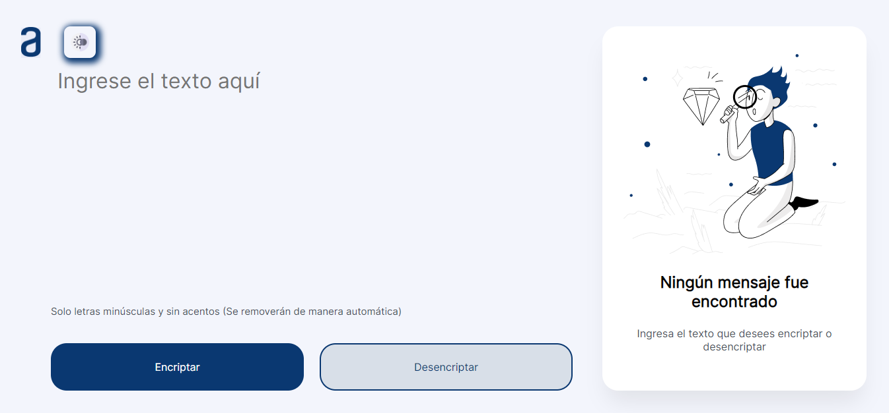

# ENCRIPTADOR DE TEXTO ALURA

Esta es una pagina web desarrollada dentro del curso de programacion basica de javascript de alura, que consiste en crear una web para encriptar y desencriptar texto, en adicion agregue un boton para el modo claro y modo obscuro.

## Autor
- [Luis Castillo](https://github.com/LuisCastle08)

# Insignia de Validacion Final

